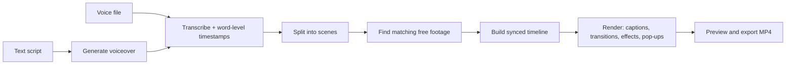

<!--
  This is a starter README. Rename "OpenReel" everywhere to your chosen project
  name, and replace the placeholder screenshot/badge/URL lines once the repo exists.
-->

<div align="center">

# 🎬 OpenReel

**Turn a script into a finished, professionally-edited video — for free.**

Upload your narration (voice) *or* a text script. OpenReel transcribes it, finds
high-quality free stock footage and images that match what you're saying, and cuts
them together in perfect sync with your voice — with captions, transitions, effects,
and on-screen pop-ups. Then you export an MP4.

Runs entirely on your own machine. No subscriptions. No watermarks. No limits.

</div>

---

## Why this exists

Great script-to-video tools are locked behind expensive subscriptions. OpenReel is a
free, open-source alternative that runs locally on your computer and uses your GPU (if
you have one) for fast processing. The goal is simple: **anyone with a story to tell
should be able to make a good video without paying a monthly fee.**

## Features

- **Two ways in** — upload a voice recording, or type/paste a text script and let the
  app generate a natural-sounding voiceover.
- **Voice-accurate sync** — visuals are timed to the *actual* words in your audio, so
  the video stays in sync even when your pace speeds up or slows down.
- **Automatic footage** — searches free, high-quality sources (Pexels, Pixabay,
  Openverse, Wikimedia Commons) for clips and images that match each line.
- **Smart pop-ups** — when you mention a key thing, a matching image or label can pop
  onto the screen at that exact moment.
- **Captions** — word-synced, animated subtitles (the kind that keep viewers watching).
- **Transitions & effects** — scene combining, crossfades, Ken Burns motion, and clean
  animations applied automatically.
- **GPU-accelerated** — uses an NVIDIA RTX card for fast transcription and encoding,
  with a CPU fallback for machines without one.
- **Review & export** — preview the result, swap any clip you don't like, then export.
- **Respects creators** — every export includes an auto-generated credits file with the
  source and license of each asset used.

## How it works



The heart of the tool is **word-level timing**: because every visual is anchored to when
a word is actually spoken, sync is correct by construction — not guessed from word counts.

## Tech stack

| Layer        | Tools (all free / open-source)                                        |
|--------------|-----------------------------------------------------------------------|
| Backend      | Python, FastAPI                                                       |
| Transcription| faster-whisper word timestamps (WhisperX optional, tighter)           |
| Voiceover    | pyttsx3 baseline; Piper / Kokoro / XTTS optional                      |
| Understanding| spaCy + YAKE; KeyBERT / local LLM (Ollama) optional                   |
| Footage      | Pexels, Pixabay, Openverse, Wikimedia Commons APIs                    |
| Rendering    | FFmpeg (NVENC) + MoviePy + Pillow                                     |
| Frontend     | React + Vite + TypeScript                                             |
| Desktop      | Tauri (optional packaging)                                            |

## Requirements

- **OS:** Windows or macOS (Linux works too) — the same steps on each.
- **Python 3.11+** and **Git** to start. **Node.js 20+** is only needed once you reach the
  frontend phase.
- **FFmpeg:** optional — a bundled binary ships with the Python deps. Install a system
  FFmpeg with NVENC only if you want GPU-fast encoding.
- **GPU (optional):** an NVIDIA RTX with recent drivers/CUDA speeds up transcription and
  encoding. Everything also runs on CPU — just slower.
- **Free API keys** (no cost) for Pexels and Pixabay — see Configuration below.

## Quickstart

The same commands work on Windows and macOS. Everything installs into a project-local
`.venv`, so nothing touches your system Python, and models cache into `./data` — never your
home drive.

```bash
# 1. Clone
git clone https://github.com/<your-username>/openreel.git
cd openreel

# 2. Create a project-local virtual environment, then activate it
python -m venv .venv
#   Windows (PowerShell):  .venv\Scripts\Activate.ps1
#   macOS / Linux:         source .venv/bin/activate

# 3. Install dependencies (into .venv) + the small language model
pip install -r requirements.txt
python -m spacy download en_core_web_sm

# 4. Configure keys
cp .env.example .env          # Windows: copy .env.example .env
#   then paste your free Pexels / Pixabay keys into .env

# 5. Run the backend (the frontend is added in a later phase)
uvicorn backend.app.main:app --reload
```

Open the app, drop in an audio file or paste a script, and click **Generate**.

## Configuration

Copy `.env.example` to `.env` and fill in your free keys:

```ini
PEXELS_API_KEY=your_key_here
PIXABAY_API_KEY=your_key_here
# Openverse and Wikimedia work without a key (rate-limited).
```

## Roadmap

- [ ] MVP: voice/text in → synced video out
- [ ] In-app timeline editing (swap clips, nudge timings)
- [ ] More effect/transition templates and themes
- [ ] Optional AI upscaling of low-res assets
- [ ] Background music with auto-ducking under narration
- [ ] One-click desktop installers

See the architecture overview in [`docs/`](docs/) for the detailed design.

## Contributing

Contributions are welcome. Please open an issue to discuss substantial changes first.
See [CONTRIBUTING.md](CONTRIBUTING.md) for setup, style, and commit conventions.

## License

Released under the [MIT License](LICENSE).

Some optional components have their own licenses (e.g. certain TTS voice models are
non-commercial). If you plan to use OpenReel commercially, prefer the permissive
components and check the licensing notes in [`docs/`](docs/).

## Acknowledgements

Built on the work of the open-source community — Whisper, WhisperX, Piper, Kokoro,
FFmpeg, MoviePy, spaCy, and the free media libraries at Pexels, Pixabay, Openverse, and
Wikimedia Commons. Thank you to every creator who shares their work freely.
