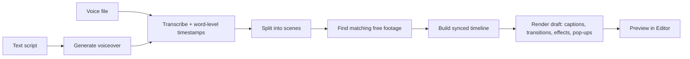

<!--
  This is a starter README. Rename "OpenReel" everywhere to your chosen project
  name, and replace the placeholder screenshot/badge/URL lines once the repo exists.
-->

<div align="center">

# 🎬 OpenReel

**Turn a script into a finished, professionally-edited video — for free.**

Upload your narration (voice) *or* a text script. OpenReel transcribes it, finds
high-quality free stock footage and images that match what you're saying, and cuts
them together in perfect sync with your voice — with captions, transitions, effects,
and on-screen pop-ups. Then you export an MP4.

Runs entirely on your own machine. No subscriptions. No watermarks. No limits.

</div>

---

## Why this exists

Great script-to-video tools are locked behind expensive subscriptions. OpenReel is a
free, open-source alternative that runs locally on your computer and uses your GPU (if
you have one) for fast processing. The goal is simple: **anyone with a story to tell
should be able to make a good video without paying a monthly fee.**

## Features

- **Two ways in** — Upload a voice recording (primary flow), or type a text script. If you provide a script, OpenReel generates a natural-sounding voiceover first, then transcribes that audio for actual timing.
- **Voice-accurate sync** — visuals are timed to the *actual* words in your audio.
- **Automatic footage** — searches free, high-quality sources (Pexels, Pixabay,
  Openverse, Wikimedia Commons) for clips and images that match each line.
- **Smart pop-ups** — when you mention a key thing, a matching image or label can pop
  onto the screen at that exact moment.
- **Captions** — word-synced, animated subtitles.
- **Transitions & effects** — scene combining, crossfades, and Ken Burns motion applied automatically.
- **GPU-accelerated** — uses an NVIDIA RTX card for fast transcription and encoding,
  with a CPU fallback for machines without one.
- **Review & edit** — preview the draft result, swap any clip you don't like, and change settings in the local React editor.
- **Recommended Workflow** — the in-app render provides a fast, lightweight draft preview. For final edits, color correction, and best quality rendering, use the **Export for Editor** action to download a zip bundle (with all assets, SRT captions, and an FCPXML/EDL project) to natively finish the timeline in CapCut, DaVinci Resolve, or Premiere Pro. (In-app final rendering is still available as an optional, slower alternative).

## How it works



The heart of the tool is **word-level timing**: because every visual is anchored to when a word is actually spoken, sync is correct by construction.

## Tech stack

| Layer        | Tools (all free / open-source)                                        |
|--------------|-----------------------------------------------------------------------|
| Backend      | Python, FastAPI                                                       |
| Transcription| faster-whisper word timestamps                                        |
| Voiceover    | pyttsx3 baseline                                                      |
| Understanding| spaCy + YAKE                                                          |
| Footage      | Pexels, Pixabay, Openverse, Wikimedia Commons APIs                    |
| Rendering    | FFmpeg (NVENC) + MoviePy + Pillow                                     |
| Frontend     | React + Vite + Tailwind                                               |

## Requirements

- **OS:** Windows or macOS (Linux works too)
- **Python 3.11+**
- **Node.js 20+**
- **GPU (optional):** an NVIDIA RTX with recent drivers/CUDA speeds up transcription and encoding.

## Quickstart (Windows PowerShell)

Everything installs into a project-local `.venv`. The frontend runs locally.

```powershell
# 1. Clone
git clone https://github.com/your-username/openreel.git
cd openreel

# 2. Create and activate a virtual environment
python -m venv .venv
.\.venv\Scripts\Activate.ps1

# 3. Install requirements
pip install -r requirements.txt
python -m spacy download en_core_web_sm

# 4. Run the backend (runs on port 8000)
Start-Process -NoNewWindow -Wait -ArgumentList "-m", "uvicorn", "backend.app.main:app", "--reload" -FilePath "python"
# Alternatively, in a separate terminal: uvicorn backend.app.main:app --reload

# 5. Install frontend packages (open a new terminal, cd to frontend)
cd frontend
npm install

# 6. Run the frontend (runs on port 5173)
npm run dev

# 7. Open the app
# Navigate to http://localhost:5173 in your browser.
```

## Configuration

Pexels and Pixabay require free API keys. These are completely optional, user-owned keys configured locally in the app's Settings page (they are never committed or uploaded).
Openverse and Wikimedia Commons do not require any API keys and will work out-of-the-box.

### Optional AI Model Key
For smarter visual search query extraction, you can optionally provide an LLM API key (OpenAI, OpenRouter, Groq, or local Ollama) in the Settings page. When configured, OpenReel performs a two-stage topic-aware analysis: it first summarizes the overall visual subject of your transcript, and then uses that context to generate highly accurate, on-topic search queries for each scene. If you don't provide a key, OpenReel falls back to a fast, built-in NLP keyword extractor (spaCy + YAKE). Your API keys are kept strictly local.

## Performance & Model Size

OpenReel is designed to be configurable for a balance of speed and quality:

1. **Concurrent Media Searching:** Asset sourcing runs concurrently across providers. High-quality indexed platforms (Pexels, Pixabay) are placed in a 'Fast Tier' and searched first, instantly skipping the slower fallback APIs (Openverse, Wikimedia) once a valid clip is found, guaranteeing searches wrap up in seconds.
2. **Transcription (Whisper):** By default, the `WHISPER_MODEL` is set to `small` in `.env.example` to provide fast, reasonably accurate transcription. If you need higher accuracy, you can change this to `medium` or `large-v3` in your `.env` file (at the cost of speed).
3. **Ken Burns Motion:** Ken Burns motion scales and resizes images per frame, which can significantly slow down rendering. You can easily toggle this off in the UI before generating for noticeably faster preview renders.
4. **GPU Encoding:** The backend automatically tries to use FFmpeg with NVIDIA NVENC (`h264_nvenc`) for blazing-fast encoding. If NVENC is not available or fails, it gracefully falls back to CPU encoding (`libx264`).

## Roadmap

- [ ] Auto-generated credits file
- [ ] P10: App packaging and polish
- [ ] P11: Visual verification (optional re-ranking)

See the architecture overview in [`docs/`](docs/) for the detailed design.

## Contributing

Contributions are welcome. Please open an issue to discuss substantial changes first.
See [CONTRIBUTING.md](CONTRIBUTING.md) for setup, style, and commit conventions.

**Local Testing**: The project uses `ruff` for linting and `pytest` for tests, which run automatically in CI. Ensure you have installed the spaCy model locally (`python -m spacy download en_core_web_sm`) and system FFmpeg before running `pytest`.

## License

Released under the [MIT License](LICENSE).

Some optional components have their own licenses (e.g. certain TTS voice models are
non-commercial). If you plan to use OpenReel commercially, prefer the permissive
components and check the licensing notes in [`docs/`](docs/).

## Acknowledgements

Built on the work of the open-source community — Whisper, WhisperX, Piper, Kokoro,
FFmpeg, MoviePy, spaCy, and the free media libraries at Pexels, Pixabay, Openverse, and
Wikimedia Commons. Thank you to every creator who shares their work freely.

## Asset Ranking & Providers
OpenReel tries the providers in the following priority order:
1. Pexels, Pixabay, Openverse (Primary searches)
2. Wikimedia Commons (Fallback to fill gaps)

Assets are scored dynamically and the most relevant is selected. **Relevance is the strict highest priority:** we calculate token-overlap between the scene's search queries and the asset's text metadata (including Pixabay's tags, Pexels' alt-text, and Openverse's titles). Any asset with zero keyword overlap is heavily penalized. Tie-breakers fall back to query priority, video vs. image preference, resolution, orientation match, and duration.
