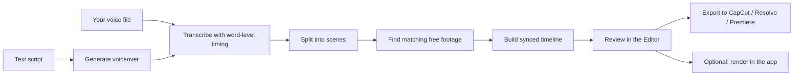

<div align="center">

# 🎬 OpenReel

**Turn your voiceover into a synced, editable video — for free.**

Upload your narration (or type a script). OpenReel transcribes it word by word, finds
free stock footage and images that match what you're saying, and lays them out on a
timeline that is synced to *your* voice and *your* pacing — with captions, motion, and
transitions. Preview it in the app, then export the whole project to CapCut, DaVinci
Resolve, or Premiere Pro to finish and render.

Runs entirely on your own computer. No subscriptions. No watermarks. No limits.

</div>

---

## Contents

- [Features](#features)
- [How it works](#how-it-works)
- [What you need](#what-you-need)
- [Setup — Windows](#setup--windows)
- [Setup — macOS / Linux](#setup--macos--linux)
- [Using OpenReel](#using-openreel)
- [Optional API keys](#optional-api-keys)
- [Exporting to your editor](#exporting-to-your-editor)
- [Configuration](#configuration)
- [GPU acceleration](#gpu-acceleration)
- [Troubleshooting](#troubleshooting)
- [Development](#development)
- [Project structure](#project-structure)
- [Roadmap](#roadmap)
- [License](#license)

## Features

- **Audio-first sync** — every clip and caption is timed to the words you actually spoke, so your pacing is always respected.
- **Two ways in** — upload a voice recording (recommended), or type a script and OpenReel generates a basic voiceover for you.
- **Automatic footage** — searches free sources (Pexels, Pixabay, Openverse, Wikimedia Commons) for clips and images that match each line.
- **Understands your whole script** — with an optional AI key, it first works out what the video is about, then picks on-topic search terms for every scene.
- **Visual verification (optional)** — a vision model looks at candidate clips and picks the one that really matches; unsure scenes are flagged "Needs review".
- **Pace control** — Relaxed, Balanced, or Dynamic. Dynamic gives a new visual for each idea instead of each sentence.
- **Punchy hook** — packs more clips into the first 30 seconds, where viewers decide whether to stay.
- **Editor** — review every scene, swap in the backup clip, change motion and transitions, add pop-ups, and edit captions.
- **Export to your editor** — a ready-to-use project bundle for CapCut, DaVinci Resolve, or Premiere Pro.
- **Optional in-app render** — a quick draft preview, or a full 1080p render if you don't use an external editor.
- **GPU-accelerated** — uses an NVIDIA GPU when available, with automatic CPU fallback.
- **AI provider failover** — add several AI keys; if one fails, OpenReel moves on to the next.

## How it works



Every visual is anchored to the moment a word is spoken, so sync is correct by construction.

## What you need

| Requirement | Version | Notes |
|---|---|---|
| **Python** | 3.11 (3.12 also works) | [python.org/downloads](https://www.python.org/downloads/) — on Windows, tick **"Add python.exe to PATH"** during install |
| **Node.js** | 22 LTS recommended (minimum 20.19) | [nodejs.org](https://nodejs.org/) — older Node versions will fail to start the frontend |
| **FFmpeg** | any recent build | Must include `ffmpeg` **and** `ffprobe` on your PATH (install commands below) |
| **Git** | any | [git-scm.com](https://git-scm.com/) |
| **NVIDIA GPU** | optional | Makes transcription much faster. Everything also works on CPU. |

Disk space: allow about 3 GB for dependencies, plus about 0.5 GB for the speech model downloaded on first use.

## Setup — Windows

Open **PowerShell** and run these steps in order.

**1. Install FFmpeg** (skip if `ffmpeg -version` already works):

```powershell
winget install --id Gyan.FFmpeg -e
```

Close and reopen PowerShell afterwards, then check both commands print a version:

```powershell
ffmpeg -version
ffprobe -version
```

**2. Get the code:**

```powershell
git clone https://github.com/Farhaal/YT-Automation-tool.git
cd YT-Automation-tool
```

**3. Create a virtual environment and install the backend:**

```powershell
python -m venv .venv
.\.venv\Scripts\Activate.ps1
pip install -r requirements.txt
python -m spacy download en_core_web_sm
```

> If `Activate.ps1` says scripts are disabled, run
> `Set-ExecutionPolicy -Scope CurrentUser RemoteSigned` once, then try again.

**4. Start the backend** (leave this window open):

```powershell
python -m uvicorn backend.app.main:app --reload --port 8000
```

You should see `Application startup complete`. Visiting <http://127.0.0.1:8000/health> should show `{"status":"ok"}`.

**5. Start the frontend** — open a **second** PowerShell window:

```powershell
cd YT-Automation-tool\frontend
npm install
npm run dev
```

**6. Open the app:** go to <http://localhost:5173> in your browser.

Next time, you only need steps 4 and 5 (activate the venv first with `.\.venv\Scripts\Activate.ps1`).

## Setup — macOS / Linux

**1. Install FFmpeg:**

```bash
# macOS (Homebrew)
brew install ffmpeg

# Ubuntu / Debian
sudo apt update && sudo apt install -y ffmpeg espeak-ng
```

(`espeak-ng` is only needed on Linux, for the "type a script" voiceover.)

**2. Get the code and install the backend:**

```bash
git clone https://github.com/Farhaal/YT-Automation-tool.git
cd YT-Automation-tool
python3 -m venv .venv
source .venv/bin/activate
pip install -r requirements.txt
python -m spacy download en_core_web_sm
```

**3. Start the backend** (leave this terminal open):

```bash
python -m uvicorn backend.app.main:app --reload --port 8000
```

**4. Start the frontend** in a second terminal:

```bash
cd YT-Automation-tool/frontend
npm install
npm run dev
```

**5. Open** <http://localhost:5173>.

## Using OpenReel

1. **Create** — upload your narration audio (or paste a script). Then choose:
   - **Format** — 16:9 (YouTube), 9:16 (Shorts), or 1:1.
   - **Motion** — slow Ken Burns zoom on images (turn off for faster previews).
   - **Pace** — Relaxed, Balanced, or Dynamic (more, shorter clips).
   - **Punchy (30s)** — extra-dense visuals in the first 30 seconds.
2. **Wait for processing** — the progress screen shows each stage live. The very first run
   downloads the speech model (about 460 MB), so it takes longer.
3. **Review in the Editor** — check each scene, **Swap Backup** for any clip you don't like,
   adjust motion and transitions, and fix any caption words.
4. **Finish your video:**
   - **Export to Editor** (recommended) — download a project bundle and finish in CapCut,
     DaVinci Resolve, or Premiere Pro. See [Exporting to your editor](#exporting-to-your-editor).
   - **Update Preview** — a quick low-quality draft render inside the app.
   - **Render Final Here (slower)** — a full 1080p MP4 rendered on your computer.

**Tip for your first test:** use a short clip (30–60 seconds). Long narrations work, but take
longer to process.

## Optional API keys

OpenReel works with **no keys at all** — Openverse and Wikimedia Commons need no key, and
scene keywords fall back to built-in text analysis. Keys make the results much better. Add
them in the app under **Settings**. They are stored only on your computer, in
`data/settings.json`, which is never committed to git.

**Stock footage (free, recommended — needed for video clips):**

| Service | Get a free key |
|---|---|
| Pexels | <https://www.pexels.com/api/> |
| Pixabay | <https://pixabay.com/api/docs/> |

**AI providers (optional — for smarter, on-topic footage):**

Under **AI Providers (Multi-Failover)** you can enable any of Google Gemini, OpenRouter,
OpenAI, Groq, or a local Ollama model. Each has its own key and model field and a **Test**
button that tells you immediately whether that key/model works. OpenReel tries the enabled
providers top to bottom; if one fails (bad key, retired model, rate limit), it moves to the
next. If all fail, it falls back to the built-in keyword extractor and shows a warning in
the Editor.

Good free options:
- **Google Gemini** — free key from [Google AI Studio](https://aistudio.google.com/). Try the model `gemini-2.0-flash`.
- **OpenRouter** — [openrouter.ai](https://openrouter.ai/) gives access to many models, including free ones.

Model names change over time — if a model stops working, use **Test** to find one that does.

**Visual verification (optional):** turn on **Visual Verification** in Settings and pick a
vision-capable **Vision Model** (for example a Gemini Flash model). OpenReel then shows the
model thumbnails of the top candidate clips and keeps the one that best matches each line.
It uses extra API calls, so it's off by default. Free models may be rate-limited; scenes that
can't be verified simply keep the normal pick and are marked "Needs review".

## Exporting to your editor

Choose the target next to **Export to Editor**, then unzip the downloaded bundle. Every
bundle contains:

- `clips/` — one video per scene, **already cut to the exact length** and numbered in order
- `audio/narration.*` — your narration
- `captions.srt` — timed captions
- `manifest.json` — scene list with sources and licenses
- `README.txt` — import steps for the target you picked

**CapCut:** import the `clips/` folder and the narration. Select all clips and drop them onto
the timeline **in number order** — they line up with the narration automatically. Put the
narration on the audio track, then use **Text → Captions → Import** to add `captions.srt`.

**DaVinci Resolve / Premiere Pro:** import `project.fcpxml` (or `timeline.edl`). If the editor
asks to relink media, point it at the `clips/` and `audio/` folders inside the bundle. Then
import `captions.srt` as a subtitle track.

**Licensing:** stock footage comes from free libraries, but some images (Openverse, Wikimedia)
require attribution. `manifest.json` lists the source, author, and license for every clip —
check it before publishing.

## Configuration

Everything works with the defaults. To change them, copy `.env.example` to `.env` and edit it.

| Setting | Default | What it does |
|---|---|---|
| `WHISPER_MODEL` | `small` | Speech model: `tiny`, `base`, `small`, `medium`, `large-v3`. Bigger is more accurate but slower. |
| `DEVICE` | `auto` | `auto` uses the GPU if available, otherwise CPU. Force with `cuda` or `cpu`. |
| `OPENREEL_DATA_DIR` | `./data` | Where models, downloads, jobs, renders, and your settings are stored. |
| `OLLAMA_URL` | `http://localhost:11434` | Address of a local Ollama server, if you use one. |

All API keys are set in the app's **Settings** page, not in `.env`.

## GPU acceleration

- **Windows + NVIDIA:** the CUDA libraries are installed automatically by `requirements.txt`.
  When the backend transcribes, the log should say `cuda` / `float16`. If it prints
  `cublas64_12.dll is not found ... Falling back to CPU`, update your NVIDIA driver and
  reinstall with `pip install -r requirements.txt`.
- **Linux + NVIDIA:** install `nvidia-cublas-cu12` and `nvidia-cudnn-cu12` with pip and add
  their library folders to `LD_LIBRARY_PATH` (see the
  [faster-whisper GPU notes](https://github.com/SYSTRAN/faster-whisper#gpu)).
- **macOS / no GPU:** runs on the CPU. Use `WHISPER_MODEL=small` or `base` for speed.
- **Video encoding** uses NVIDIA NVENC when your FFmpeg supports it, and falls back to the CPU otherwise.

## Troubleshooting

| Problem | Fix |
|---|---|
| `ffmpeg` / `ffprobe` not found, or export fails | Install FFmpeg (see Setup), then **close and reopen** the terminal and restart the backend. |
| `Can't find model 'en_core_web_sm'` | Run `python -m spacy download en_core_web_sm` inside the activated venv. |
| `Activate.ps1 cannot be loaded` (Windows) | `Set-ExecutionPolicy -Scope CurrentUser RemoteSigned`, then activate again. |
| Frontend loads but nothing happens / network errors | The backend must be running on **port 8000**. Check <http://127.0.0.1:8000/health>. |
| `npm run dev` fails with a Node/Vite version error | Install Node.js 22 LTS. |
| Port 8000 already in use | Stop the other program using it, or close the old backend window. |
| First generation is very slow | The speech model downloads on first use. Later runs are much faster. On CPU, long audio takes a while — see [GPU acceleration](#gpu-acceleration). |
| Footage looks generic or off-topic | Add a Pexels/Pixabay key and an AI provider in Settings, and press **Test** to confirm the AI key works. |
| Editor shows "AI query model failed" | That provider/model didn't work. Use **Test** in Settings to find a working model, or enable another provider. |

## Development

```bash
pip install pytest ruff
pytest              # backend tests
ruff check .        # lint

cd frontend
npm run test        # frontend tests
npm run build       # type-check and production build
```

The same checks run automatically on every push (GitHub Actions). See
[CONTRIBUTING.md](CONTRIBUTING.md) for conventions.

## Project structure

```
backend/          FastAPI server: transcription, scenes, footage search, timeline, render, export
  app/api/        HTTP routes
  app/services/   pipeline stages (transcription, nlp, assets, timeline, renderer, exporter)
  tests/          pytest suite
frontend/         React + Vite + Tailwind app (Creator, Editor, Settings)
shared/           timeline JSON schema shared by backend and editor
scripts/          environment check helper (python scripts/check_env.py)
docs/             architecture notes
samples/          small test audio
data/             created at runtime: models, jobs, renders, settings (git-ignored)
```

## Roadmap

- [ ] Captions that exactly match an uploaded script (script-guided alignment)
- [ ] Free local visual verification (CLIP on your GPU, no key needed)
- [ ] License-filtered web image search for specific, real-world visuals
- [ ] Motion graphics and animated callouts
- [ ] Auto-generated credits file
- [ ] One-click desktop app packaging

## License

Released under the [MIT License](LICENSE).

## Acknowledgements

Built on open-source work including faster-whisper, spaCy, YAKE, MoviePy, FFmpeg,
OpenTimelineIO, FastAPI, React, Vite, and Tailwind — and the free media libraries at
Pexels, Pixabay, Openverse, and Wikimedia Commons. Thank you to every creator who shares
their work freely.
